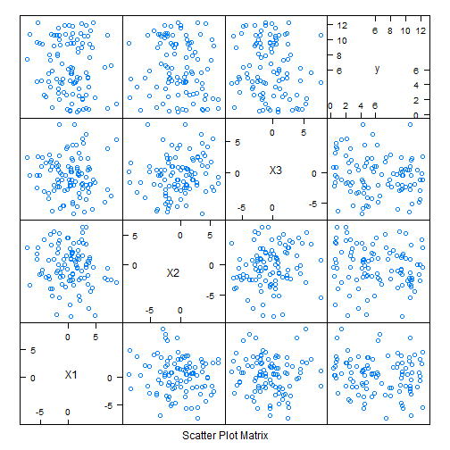

## The Concept

Since many students who choose to study machine learning have some basic knowledge of linear algebra, this application uses the process of solving a system of N linearly independent equations with N unknowns to demonstrate how latent variables effect the generation a synthetic dataset using known relationships. Specifically, a dataset is generated by solving the linear system $$ay*sin(Y)=ax*X$$ where Y is a randomly generated and X is a the solution vector.

Visualizing the plots using the caret featurePlot function helps make sense of how the data will look when it has issues common to the real world such as a high variance to sample size ratio or features with different scales. 

---

## The Algorithm

The steps to generate the data are as follows:

1. First the user selects parameter values such as number of sample points and maximum and minimum coefficient values 
2. Next a matrix of coefficient values for the linear system is generated:
3. A vector of random y values is generated, and the sin function is applied to every element in y. This generates the left hand side of the linear system of equations
4. The system $$ay*sin(y)=ax*X$$ is then solved for every point y, generating a matrix of X vectors with a well defined relationship to y.
5. Noise sampled from the normal distribution is then added the X vectors corrupting the data.
6. Finally the results are visuallized using the featurePlot function.

---

# Example

Try It Yourself at https://clockworkworld.shinyapps.io/Project/


```r
nfeatures<-3;npts<-100;ymin<-0;ymax<-4*pi;amin<--pi;amax<-pi;sdnoise<-pi
```




---

# Planned Capabilities

There are many potential extensions to this applications that may be added dependent on user interest.

Some Planned Extensions Are:

* Applying a machine learnign algorithm to the dataset instead of just looking at it
* Showing the effects of Principal components analysis
* Using multiple y vectors
* Using multiple source functions

